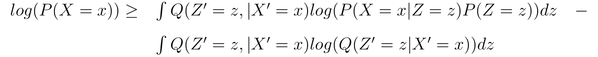
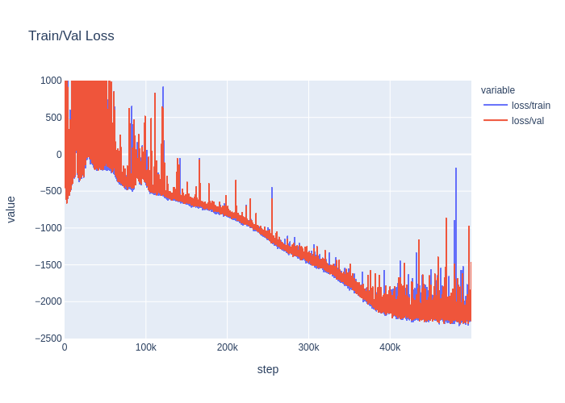

Normalizing Flows Paper Implementation
======================================

This is an unaffiliated implementation of the following paper:

    Rezende, D.J. and Mohamed, S., 2015. Variational inference with normalizing flows. arXiv preprint arXiv:1505.05770.
    

<i>Test Data vs. Reconstruction</i>
 

### Motivation

Given some probabilistic graphical model, typically one would like to perform inference
to be able to query the model under certain conditions. For example, starting with the joint distribution
`P(X, Y, Z)`, one could try to infer `P(X|Y=y)`. Often times, this type of query can be intractable
to perform exactly and so one must resort to approximate methods. One class of approximate inference
methods is variational inference, which poses this problem as an optimization over the
space of probability distributions. In particular, one is trying to find a valid probability
distribution that is closest to the true distribution (i.e. `P(X|Y=y)`) given some measure of similarity
between distributions. This challenge of
performing inference in graphical models comes up frequently when building generative models of data.
Although there are a variety of ways to build graphical models that can be sampled (generative), directed
graphical models (DAGs) are a common way to do so and provide an intuitive hierarchical structure
as well as an easy sampling algorithm (ancestral sampling) in contrast with other approaches such as
Markov Chain Monte Carlo (MCMC) methods.

When trying to learn the generative distribution of some dataset (using a DAG), it
is often the case that there are latent/hidden variables that affect the observable variables
in a variety of ways but that cannot be directly modeled. Being able to capture these relationships
could potentially enable learning the data distribution more effectively as well as provide a means to
disentangle feature representations in an unsupervised way. 

The joint distribution 
of the observable and latent variables is often denoted by `P(X, Z)`, where X symbolizes the 
observable variables and Z symbolizes the latent variables. This joint distribution is commonly
factorized as `P(X, Z) = P(X | Z) * P(Z)`, which corresponds to the simple DAG in which Z points
to X. Another assumption that is made is that the available datasets contain IID samples from the data 
distribution `P(X)`. Following the maximum likelihood principle one 
could then try to optimize `log(P(X))`. However, given that the joint is `P(X, Z)`, 
computing `P(X)` would require performing inference which as mentioned is often not tractable.

Note that the log-likelihood of the data distribution can instead be approximated by a lower bound as follows:

<!--

    log(P(X = x)) = log( \int {P(X = x| Z = z) P(Z = z) dz} )

    log(P(X = x)) = log( \int {\frac{Q(Z' = z, | X' = x)}{Q(Z' = z, | X' = x)}P(X = x| Z = z) P(Z = z) dz})

    log(P(X = x)) \ge \int { Q(Z' = z, | X' = x) log( \frac{P(X = x| Z = z) P(Z = z)}{Q(Z' = z, | X' = x)}) dz}

    \begin{tabular}{ l c r }
        $log(P(X = x)) \ge$ & $\int { Q(Z' = z, | X' = x) log( P(X = x| Z = z) P(Z = z) ) dz }$ & $-$ \\
        & $\int { Q(Z' = z, | X' = x) log(Q(Z' = z | X' = x)) dz }$ &  \\
    \end{tabular}

-->
    

This bound is known as the Expectation Lower Bound (ELBO) and can be interpreted in a number of
ways. One key point is that the ELBO can be rewritten to show that it has one term that
maximizes the negative KL-divergence (a measure of similarity) between `Q(Z' = z | X' = x)` 
and `P(Z = z)` while a second term maximizes the log-likelihood of `P(X = x | Z = z)` 
under the Q distribution. The first term is known as the regularization term, where the prior
on Z is considered the regularizer. The equivalence is shown below:

<!--

    \begin{tabular}{ l c r }
        $log(P(X = x)) \ge$ & $\int { Q(Z' = z, | X' = x) log( P(X = x| Z = z) P(Z = z) ) dz }$ & $-$ \\
        & $\int { Q(Z' = z, | X' = x) log(P(Z = z)) dz }$ &  \\
    \end{tabular}

    log(P(X = x)) \ge \int { Q(Z' = z, | X' = x) log( \frac{P(Z = z)}{ Q(Z' = z | X' = x) } dz } + \int { Q(Z' = z, | X' = x) log(P(X = x| Z = z)) dz }

-->

Prior to normalizing flows, the approximate posterior, `Q(Z'|X')`, was typically
limited to a subset of distributions that were easily optimized, such as a mean-field approximation.
The downside to this approach is that the true posterior would never be guaranteed to be learned even
in the limit of infinite data due to the inherent parameterization being used.

Normalizing flows tackles this problem by allowing for an easily parameterizable probability distributions
which given enough parameters and data can approximate any distribution.

### Key Contributions

* Proposed the novel normalizing flows class of models for approximate posterior inference.
* Proved that a subset of normalizing flows can asymptotically recover the true posterior.
* Unified a variety of approaches under the normalizing flows formalism.
* Outperformed other competing approaches for approximate posterior inference on a set of experiments, including on MNIST and CIFAR-10.

### Approach

The key idea that was leveraged is that of a normalizing flow. Starting with
an initial density over some random variable, one can apply a chain of invertible
transformations on the random variable to yield another random variable. The
principle of normalizing flows shows that the probabilistic density over the
transformed random variable can be computed solely from the initial density
and the jacobians of the transformation functions that were applied. Specifically,
given an initial density `q(z)`, and applying the invertible transformation
`z' = f(z)`, then the density over the new random variable is given by:

<!--

    q(z') = q(z) |det \frac{\partial f^{-1}}{\partial z'}| = q(z)|det \frac{\partial f}{\partial z'}|^{-1}

-->

This rule can be applied over a chain of invertible transformations in exactly the same way,
resulting in an exact specification of the distribution over the final random variable.

Additionally, applying this rule indefinitely results in a class of
normalizing flows known as infinitesimal flows which can be characterized,
for example, by a stochastic differential equation.

In the paper, however, the main focus was on invertible linear-time transformations
which are formulated as:

<!--

    f(z) = z + u * h(w^T z + b)

-->

where u and w are vectors, and b is a scalar parameter.

It was shown for two instances of this transformation, named planar flows and radial flows,
that under certain conditions this function is invertible. Additionally, the jacobians
were derived and used in the formulation of the ELBO (negative free energy) loss function.

Once the loss function was computed, optimization was carried out using backpropagation.

See the paper for more detail.

### Implementation

This implementation focused on applying planar flows to the binarized Fashion MNIST dataset. It is structured
in a way that can be extended relatively easily to other normalizing flows and generally
follows the details laid out in the original paper. One key difference is that the deep neural
networks use the tanh activation rather than the maxout activation. 

Training a model with a flow size of 10 for 500k iterations produced the following plot:

    

